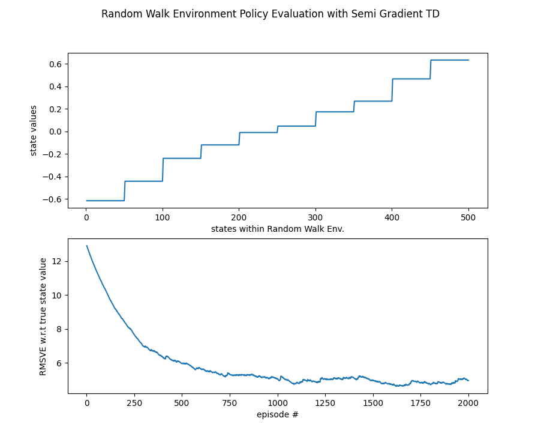
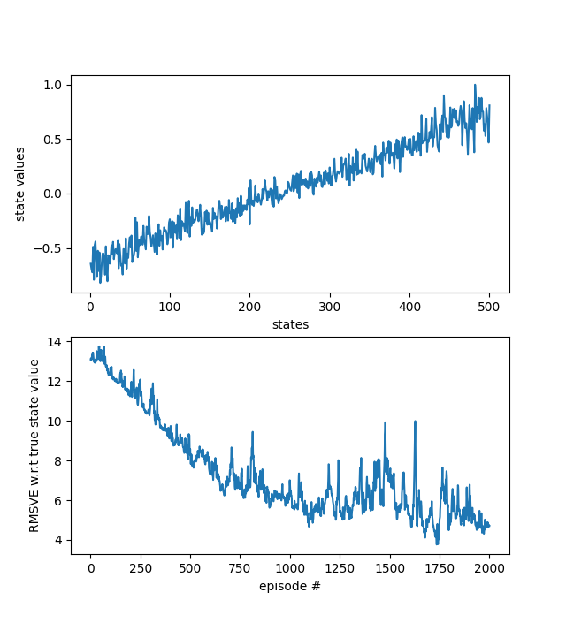

# lazy_robotics_workspace
experimental area for lazy robotics projects with minimal functionality and minimal explanation to get started fast.

Quick notes:
# LazyBot

DC motor currently being used is: http://xinhemotor.bossgoo.com/geared-motors/gear-motor-xh-gm-370-metal-gear-motor-with-48-cpr-encoder-and-two-channel-hall-effect-encoder-13156509.html
The encoder on the motor is giving 48*(~34 = gear ratio)=1632 counts per rev, with 2 of the hall sensors working in quadrature mode. In other words, reading just 1 rising edge of 1 hall sensor would give 408 encoder interrupts.

# RL
## Policy Evaluation
Temporal difference (TD) is a method that utilizes Markov property to get an estimate of the value ("goodness") of being in a specific state within an environment. TD updates the value of a state, towards it's own estimate of the value in the next state. TD(0) specifically keeps track of only previous state to compute the current state value. There is no model of the environment here, state estimation is acquired via sampling from the environment. 
### TD with state Aggregation in Random Walk Environment
- Aggregate the states close to each other under a "feature"
- Each feature gets a weight to produce a "state value"
- Apply semi-gradient TD update for updating weights during random walk
- Propagate the learnt weights to the next episode to keep learning

### TD with state Aggregation in Random Walk Environment
- Represent the states with one-hot encoding 
- Generate a NN which has # states many inputs and single output for estimating the state value
- Use ADAM optimization and TD update to update the weights at each agent step
- Propagate the learnt weights to the next episode to keep learning

### Deep SARSA on Cartpole

